# CI/CD Pipeline with Integrated Security Scanning


A fully automated CI/CD pipeline for a Python Flask application with security scanning, code quality analysis, and containerized deployment on AWS.

## Overview

This project demonstrates a production-ready CI/CD workflow that automatically builds, tests, scans, and deploys a containerized web application. Every code push triggers an automated pipeline that ensures code quality and security before deployment.

## What I Built

**Infrastructure & Pipeline**
- Set up Jenkins on AWS EC2 as the CI/CD orchestrator
- Configured automated GitHub webhooks to trigger builds on every push
- Deployed SonarQube for continuous code quality monitoring
- Integrated Trivy for container vulnerability scanning

**Automation & Deployment**
- Containerized the Flask application with Docker
- Implemented automatic versioning and tagging of Docker images
- Automated deployment workflow: stops old container, pulls new image, and deploys updated version
- Configured all services (Jenkins, SonarQube, App Server) to work together seamlessly

**Security & Quality**
- Static code analysis with SonarQube to catch code smells and maintainability issues
- Container image scanning with Trivy to identify vulnerabilities before deployment
- Pipeline fails if critical security issues are detected

## Workflow Diagram

```mermaid
graph TB
    Developer["👨‍💻 Developer<br/>Pushes Code"]
    GitHub["📦 GitHub<br/>Repository"]
    Webhook["🔔 Webhook Trigger"]
    Jenkins["🔧 Jenkins Server<br/>(CI/CD Orchestrator)"]
    
    Checkout["1️⃣ Checkout Code<br/>Pull from GitHub"]
    SonarQube["2️⃣ Code Quality Scan<br/>SonarQube Analysis"]
    Build["3️⃣ Build Docker Image<br/>Tag with Version"]
    Trivy["4️⃣ Security Scan<br/>Trivy Vulnerability Check"]
    Deploy["5️⃣ Deploy Container<br/>Stop Old → Start New"]
    
    SonarServer["☁️ SonarQube Server"]
    AppServer["🖥️ App Server<br/>Docker Runtime"]
    Success["✅ Deployment Success<br/>App Live"]
    Fail["❌ Pipeline Failed<br/>Issues Found"]
    
    Developer --> GitHub
    GitHub --> Webhook
    Webhook --> Jenkins
    Jenkins --> Checkout
    Checkout --> SonarQube
    SonarQube --> SonarServer
    SonarServer --> |Quality Check Pass| Build
    SonarServer --> |Quality Issues| Fail
    Build --> Trivy
    Trivy --> |No Vulnerabilities| Deploy
    Trivy --> |Vulnerabilities Found| Fail
    Deploy --> AppServer
    AppServer --> Success
    
    style Developer fill:#964B00 
    style GitHub fill:#FFA500
    style Jenkins fill:#000080
    style SonarServer fill:#341539
    style AppServer fill: #556B2F
    style Success fill:#008000
    style Fail fill:#FF0000
```




## Technologies Used

- **Jenkins** - CI/CD automation server
- **Docker** - Containerization platform
- **SonarQube** - Code quality and security analysis
- **Trivy** - Container vulnerability scanner
- **Git & GitHub** - Version control and webhooks
- **Python (Flask)** - Application framework
- **AWS EC2** - Cloud infrastructure (Ubuntu)

## Repository Structure

```
cicd-secured/
├── Jenkinsfile                 # Pipeline definition
├── Dockerfile                  # Container image specification
├── sonar-project.properties    # SonarQube configuration
├── app/
│   └── main.py                # Flask application
├── requirements.txt            # Python dependencies
└── tests/                     # Test files
```


## Key Achievements

✅ Fully automated pipeline from code push to production deployment  
✅ Zero-downtime deployments with container orchestration  
✅ Integrated security scanning at the container level  
✅ Code quality gates to maintain high standards  
✅ Multi-server architecture (Jenkins, SonarQube, App Server)

## Documentation formatting and structure assisted by AI tools

